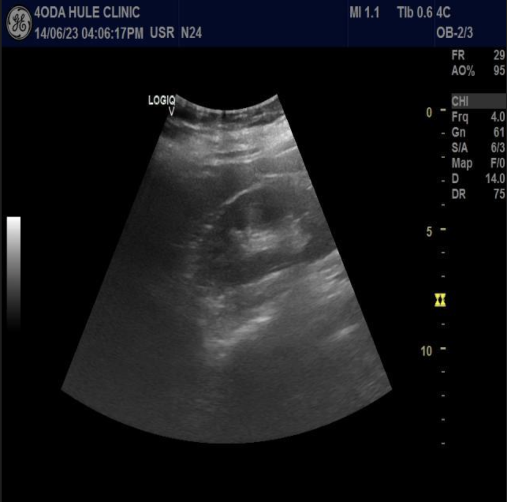
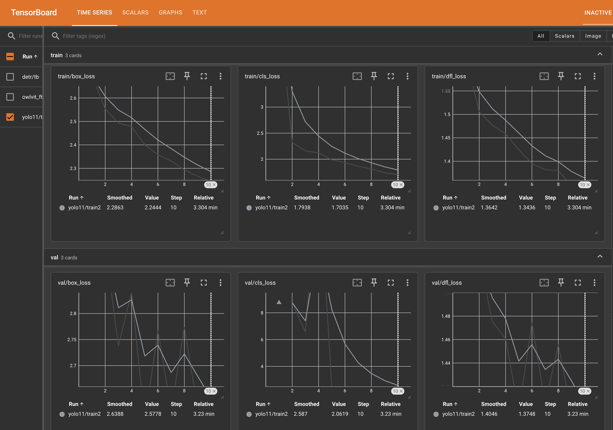
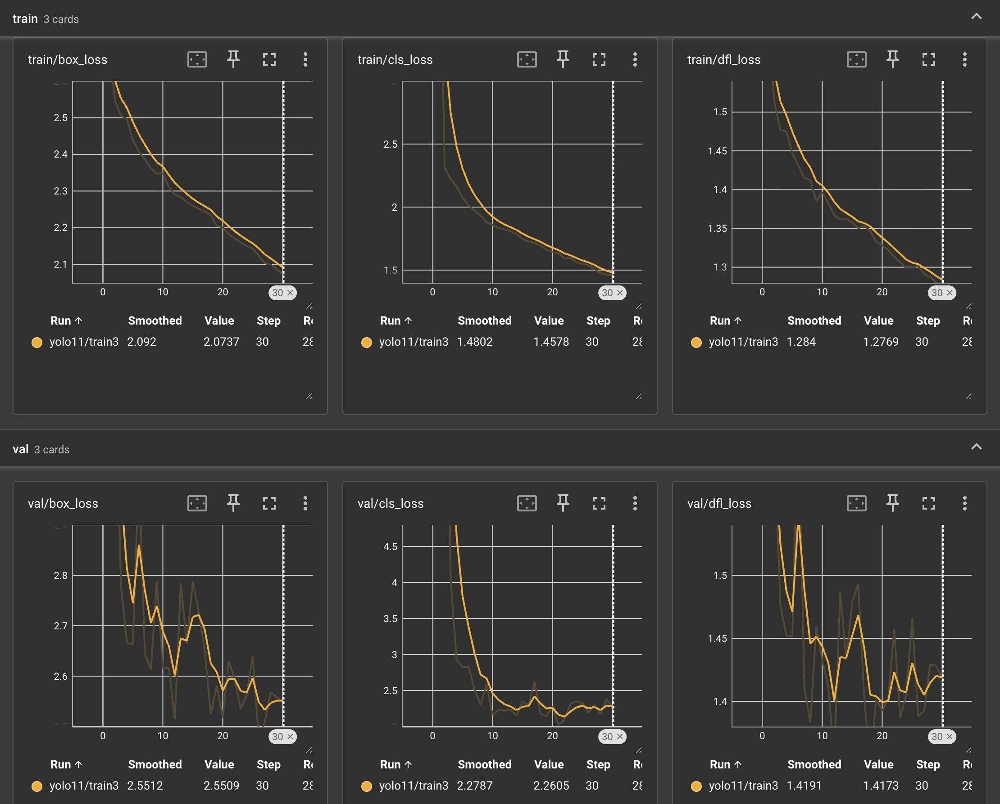
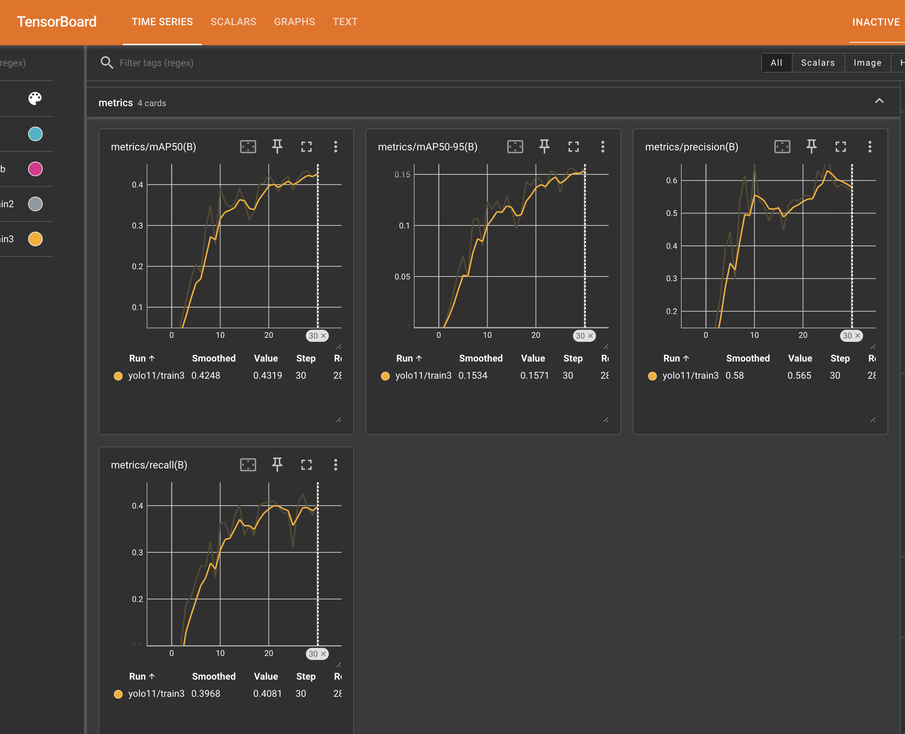
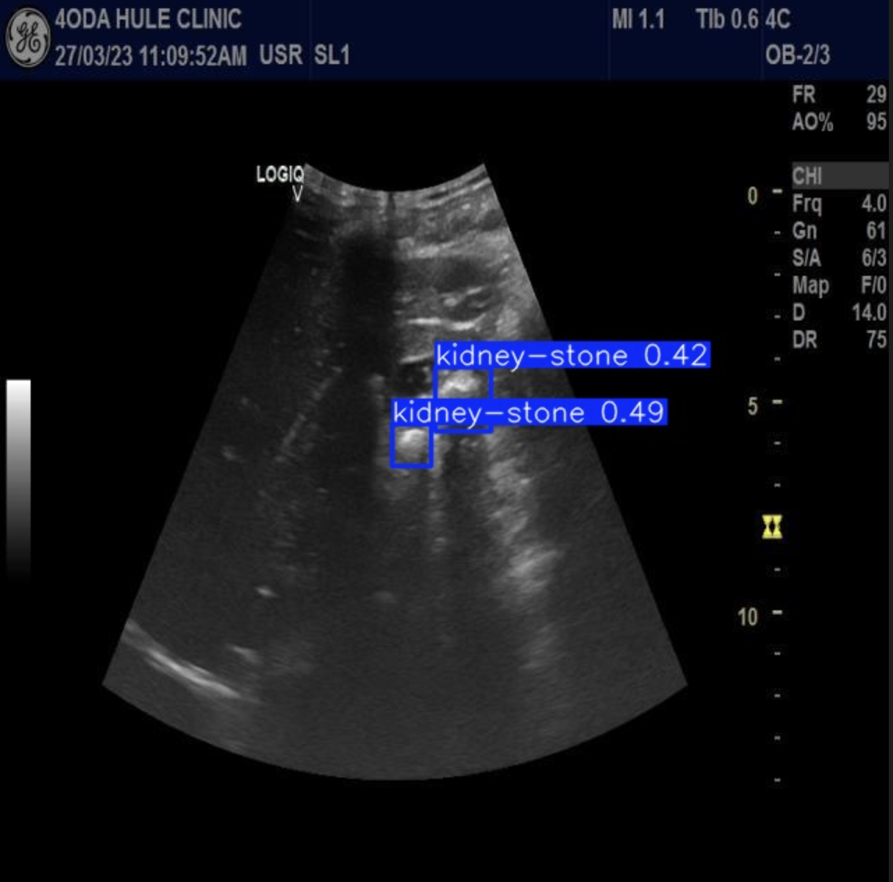
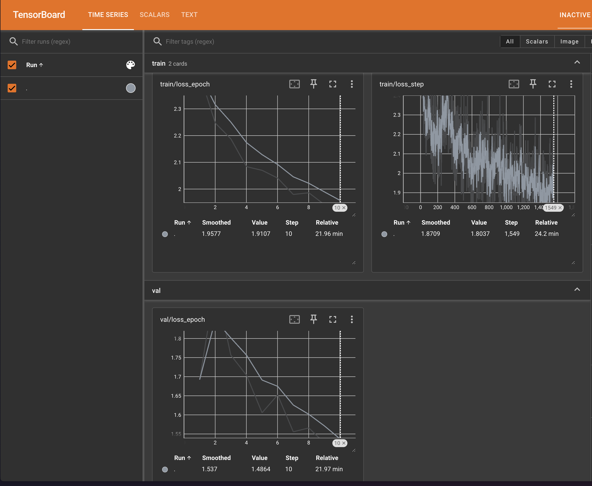
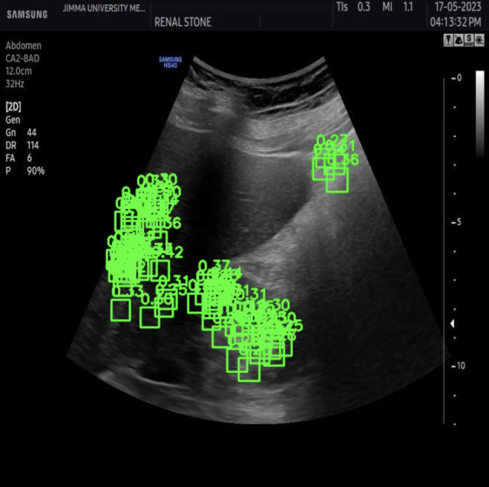
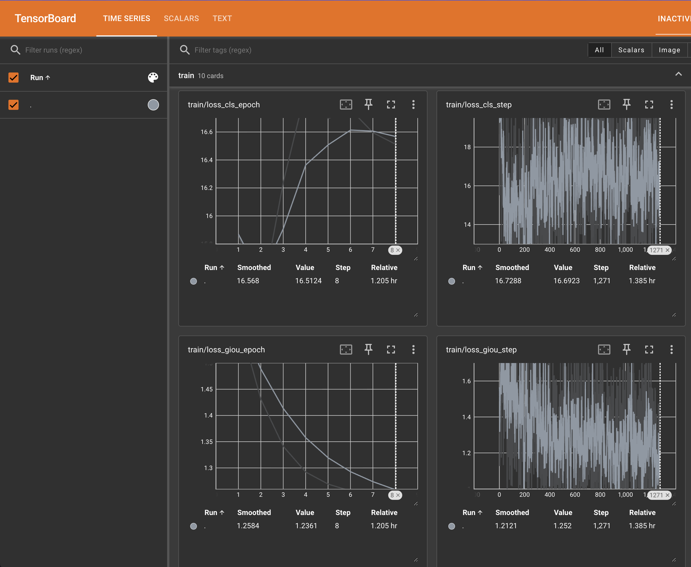
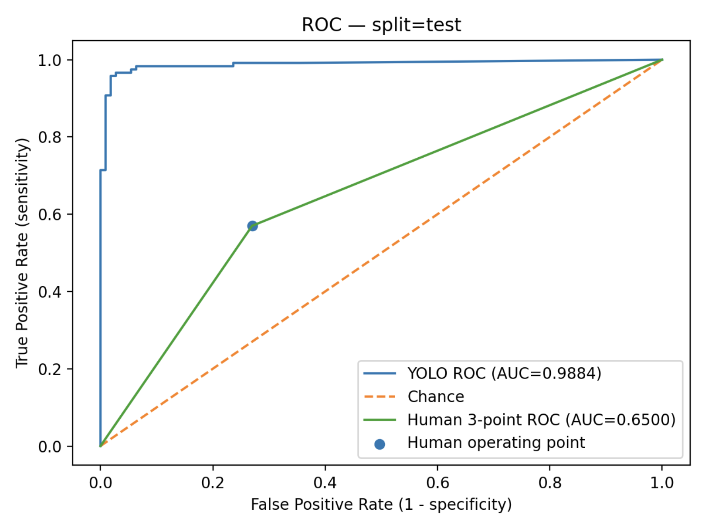

# Детекция камней в почках на датасете Ultrasound — YOLOv11 vs DETR vs OWLViT

> **Цель:** обучить и сравнить несколько подходов для детекции камней в почках (УЗИ), а также сопоставить качество лучшей модели с опубликованной “человеческой” точностью из клинической литературы.

### Почему это важно?
Чтобы понять ценность внедояемой технологии, мы опросили 3-ех квалифицированных врачей, связанных с этой областью (Нефрологи, УЗИ-диагносты). Вот что нам удалось выяснить:
- Нужна работа над сомнительными случаями дифференциальной диагностики с другими структурами: часто за камни принимают сосудистые образования.
- Когда у человека образовываются мелкие камни, то ранняя диагностика страдает. Многие врачи пропускают мелкие камни, из-за чего могут возникнуть осложнения.
- Начинающие специалисты часто игнорируют образования небольших размеров, предложенный сервис поможет избежать таких случаев.

---

## 1. Задача

Мы решаем задачу **детекции объектов**: на вход подаётся УЗИ-изображение почки, на выход — bounding boxes камней (если они есть).

Особенность домена УЗИ:
- **сильный шум**, спекл, низкий контраст;
- **камни могут быть маленькими**, не всегда отчётливо видны;
- часто важны косвенные признаки (например, акустическая тень), которые могут быть неоднозначны;
- много **негативных** кадров без камней (это нормально и даже полезно, но создаёт дисбаланс).

Пример изображения:



---

## 2. Данные и разметка

Датасет содержит ~5000 изображений с реального УЗИ почек. Проверка разметки показала:

- `train: images=4942, empty_labels=2063`  
- `val:   images=260,  empty_labels=152`  
- `test:  images=229,  empty_labels=110`

**Что такое `empty_labels`:** это изображения, для которых файл разметки существует, но внутри **нет ни одного бокса** — то есть *негативные примеры* (“камня нет”).

---

## 3. Модели в исследовании

Мы сравнивали 3 модели:

1) **OWLViT**  
2) **DETR**  
3) **YOLOv11**

---

## 4. Результаты

### 4.1 YOLOv11 — лучшая модель
Обучение: Full Fine-Tuning
Кол-во параметров: ≈9.4M

Метрики лучшего чекпоинта на test (10 эпох обучения):
```json
{
  "mAP50": 0.5523782727478827,
  "mAP50_95": 0.202378283748728,
}
```

Графики в Tensorboard:




Финальные метрики лучшего чекпоинта на test (30 эпох):
```json
{
  "mAP50": 0.5928211736895577,
  "mAP50_95": 0.2346057270898549,
}
```

Т.е. Модель находит достаточно неплохо область с камнем (поэтому mAP50 нормальный), но рисует рамку достаточно неаккуратно.

Графики в TensorBoard:





Пример детекции на инференсе:



**Примечание:** мы специально сравнили DETR и YOLO **на одинаковом кол-ве эпох (10)** — YOLO победил уверенно. (Результаты обучения DETR идут далее, в след. пункте).

---

### 4.2 DETR

Обучение: **замороженный backbone**. Остальные параметры обучаются.
Кол-во параметров: ≈41.4M

Итог на test:
```json
{
  "mAP50_95": 0.003300558264740635,
  "mAP50": 0.016413890501273294
}
```

TensorBoard:



Пример детекции на инференсе:



#### Гипотеза, почему DETR так себя повел

Главная особенность DETR в том, что у неё мало встроенных знаний о том, как искать объекты. Ей нужно учиться этому с нуля, что требует много времени и точных настроек.
Основные причины провала в данном случае:
- Неподходящий опыт: Модель обучалась на обычных фотографиях, а зрительную часть (backbone) мы заморозили в целях эффективности. Из-за этого она просто не научилась распознавать специфичные черно-белые структуры на УЗИ.
- Сложность с мелкими объектами: Камни на УЗИ маленькие и нечеткие. Базовая версия DETR исторически плохо справляется с мелкими объектами без дополнительных настроек.
- Слишком мало времени: Мы обучали модель всего 10 эпох. Для DETR это достаточно мало — эта архитектура долго запрягает и начинает давать результат только при длительном обучении.

---

### 4.3 OWLViT
Обучение: **Заморожен backbone**. Остальные параметры обучаются.
Кол-во параметров: ≈200M

TensorBoard:



#### Гипотеза, почему OWLViT не обучился
Модель OWLViT в библиотеке HuggingFace создана для работы из коробки для zero-shot — она ищет объекты по текстовому описанию. Эта модель архитектурно не предназначена для стандартного дообучения.
Две главные проблемы:
- Программная несовместимость: Судя по логам, модель просто игнорирует разметку. В её коде нет встроенного механизма, который бы принимал правильные ответы и учился на ошибках стандартным способом.
- Другая логика работы: Обычные детекторы выбирают класс из списка (например, класс №1 — камень). OWLViT работает иначе: она сравнивает картинку с промптом. Чтобы дообучать такую систему, стандартные методы как будто не очень подходят — нужен более сложный, кастомный алгоритм настройки, которого нет в стандартном доступе.

---

## 5. Почему YOLOv11 победил?

### **Гипотеза:** Почему YOLOv11 работает лучше

Успех YOLO объясняется тем, что эта модель изначально заточена под практическое применение и имеет архитектуру, которая облегчает обучение.
Преимущества YOLO в этой задаче:
- Скорость обучения: Прежде всего, это one-stage модель. Она не тратит время на сложные промежуточные этапы отбора предложений, поэтому начинает давать результат гораздо быстрее, даже за малое количество эпох.
- Прямолинейность: Обучение идет более стабильно и напрямую, без сложной механики сопоставления (matching), которая есть в DETR.
- Работа с мелочами: При правильном размере входного изображения YOLO на практике гораздо лучше замечает мелкие объекты (те же камни в почках), чем базовый DETR.

Проблемы DETR:
- DETR — это мощная, но более сырая архитектура. Чтобы она заработала, нужно:
    * гораздо больше эпох;
    * разрешить ей дообучать backbone (Что уже дает гигантский проигрыш по сравнению с YOLO, даже если получим сопоставимое качество);
    * очень тонко подбирать параметры.

Без этого всего DETR просто не успевает настроиться.

---

## 6. Сравнение с человеческой точностью: sensitivity и specificity

### 6.1 Определения
Мы оцениваем работу модели на уровне всего изображения (image-level): считается, что модель права, если она верно определяет наличие или отсутствие камня на снимке в целом (наличие хотя бы одной подтвержденной разметки).
Для оценки используются две ключевые метрики:
1) Чувствительность (Sensitivity aka Recall): Показывает, какой процент реальных камней модель смогла обнаружить.
    * Формула: `TP / (TP + FN)`
2) Специфичность (Specificity aka TNR): Показывает, как хорошо модель понимает, что камня нет, и не дает ложных срабатываний на здоровых органах.
    * Формула: `TN / (TN + FP)`

### 6.2 Human Baseline
В качестве эталона мы берем результаты врачей-радиологов из клинического исследования Smith-Bindman et al. (NEJM, 2014). При первичном УЗИ-обследовании показатели врачей таковы:
- Чувствительность: 57% (интервал 51–64%) — врачи находят лишь чуть больше половины камней.
- Специфичность: 73% (интервал 69–77%) — в остальных случаях возможны ложные подозрения.

Источники:
- NEJM (full text): https://www.nejm.org/doi/full/10.1056/NEJMoa1404446
- PubMed: https://pubmed.ncbi.nlm.nih.gov/25229916/

> Важно: метрики из статьи относятся к клинической постановке и другому референс-стандарту, поэтому сравнение с нашим датасетом нужно интерпретировать осторожно.

### 6.3 Наша YOLOv11: case-level sens/spec на test
Сначала мы посчитали **image-level** метрики (камень есть/нет) при двух порогах `conf`:

**conf = 0.0025**
```
split=test images=229 positives=119 negatives=110
conf=0.0025
          TP: 118
          FP: 29
          TN: 81
          FN: 1
 sensitivity: 0.9916
 specificity: 0.7364
   precision: 0.8027
    accuracy: 0.8690
```

**conf = 0.25**
```
split=test images=229 positives=119 negatives=110
conf=0.25
          TP: 109
          FP: 2
          TN: 108
          FN: 10
 sensitivity: 0.9160
 specificity: 0.9818
   precision: 0.9820
    accuracy: 0.9476
```

### 6.4 Почему так получилось
Это классический trade-off порога уверенности:

- При **очень низком пороге** `conf=0.0025` модель разрешает слабые сигналы =>  
  **FN почти исчезают** (чувствительность ~0.99), но растут **FP** (специфичность падает до ~0.74).

- При **высоком пороге** `conf=0.25` модель становится консервативной => 
  **FP почти исчезают** (специфичность ~0.98), но часть истинных камней пропускается → sensitivity падает.

Почему sensitivity резко растёт при снижении `conf`:
- вероятно, много истинных камней предсказываются **с невысокой уверенностью** из-за шума УЗИ, маленьких объектов, неоднозначных признаков и вариативности разметки. Поэтому снижение `conf` вытаскивает правильные, но слабоуверенные детекции вместе с частью ложных.

### 6.5 Как корректно сравнивать с человеком
1) Первый методологически честный приём — **сравнивать sensitivity при одинаковой specificity** (или наоборот).  
Например, режим `conf=0.0025` дал specificity ~0.736, что близко к 0.73 из Human Baseline, и при этом sensitivity модели значительно выше (`0.99` vs `0.57`).
2) Второй прием - построить честный ROC AUC для модели и ROC AUC по трем точкам для Human Baseline (Да, тут не совсем честно сравнивать, но это очень сильно помогает сформировать представление о качестве решения данной задачи). Вот что у нас получилось:



---

## 7. Практические выводы и рекомендации

### 7.1 Дальнейшее развитие
1) Добавить отчёт **FROC** (sensitivity vs FP/image) — для медицины часто информативнее, чем mAP.
2) Разделить оценки:
   - detection-level (mAP/FROC)
   - case-level (sens/spec)
3) Калибровать `conf` под нужный риск-профиль,
4) Попробовать:
   - больший `imgsz` (если камни маленькие),
   - более полноценный датасет, т.е. взять больше сэмлов для обучения,
   - более долгий train (на всякий случай),
   - более УЗИшные аугментации (не все фото-аугментации полезны),
   - *для DETR*: разные LR (backbone vs остальное) + больше эпох + возможно улучшенный DETR-вариант.

---

## 8. Общий итог исследования

- **YOLOv11 оказался лучшей моделью** для детекции камней на УЗИ в рамках нашего бюджета и данных: хорошие mAP и управляемый trade-off sensitivity/specificity.  
- **DETR показал крайне слабые метрики** при замороженном backbone и малом числе эпох — наиболее вероятно из-за доменного сдвига УЗИ и высокой сложности обучения.
- **OWLViT дообучить не получилось**: в используемой реализации/версии модель не поддерживает supervised-loss по `labels/targets`, а сама архитектура и training-постановка заточены под open-vocabulary / zero-shot сценарий.
- Сравнение с человеком возможно через sens/spec (при одинаковой specificity/sensitivity), но следует помнить, что опубликованные клинические цифры относятся к другой постановке и референсу.
